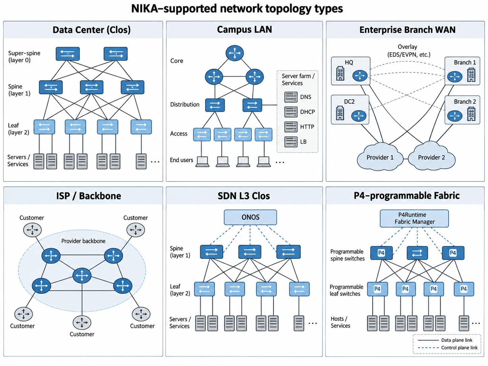

<div align="center">


<br />

[✨ Features](#-features) ·
[🤖 Overview](#-overview) ·
[📦 Installation](#-installation) ·
[🚀 Quick start](#-quick-start) ·
[📖 Learn more](#-learn-more) ·
[📄 Docs](docs/README.md) ·
[🌐 Website](https://sands-lab.github.io/nika/) ·
[📚 Cite](#-citation)

[](https://arxiv.org/abs/2512.16381)
[](https://sands-lab.github.io/nika/)
[](https://www.open-telco.ai/resources/nika/)

</div>

## 📰 News

- **2026-09-01:** Published [nika-bench 0.2.0](benchmark/releases/0.2.0/README.md). `nika leaderboard submit` now packs agent trajectories and opens a Hugging Face dataset PR; see [leaderboard submission](docs/benchmarks/leaderboard-submission.md).
- **2026-08-15:** Operational settings moved fully to `config/nika.yaml`. New installations can copy `config/nika.example.yaml`; existing installations with operational `.env` keys can run [`nika config migrate`](docs/operations/cli-reference.md#nika-config).
- **2026-08-13:** Updated benchmark labels and evaluation. Users with older custom benchmark YAML can [migrate their case matrices](docs/benchmarks/root-cause-evaluation.md#materialize-labels-on-a-case-matrix).

## ❓ What is NIKA?

Think about [SWE-Bench](https://github.com/swe-bench/SWE-bench), but for network troubleshooting. [NIKA](https://sands-lab.github.io/nika/), **N**etwork **I**ncident Benchmar**k** for **A**I Agents, is an *open benchmark for agentic evals on network troubleshooting tasks*. NIKA reproduces network incidents across data center and campus networks, enterprise WAN overlays, ISP backbones, SDN and P4 fabrics, Kubernetes clusters, and vendor routing labs. It connects any agent directly to a live network stack while the incident is ongoing, evaluating the ability of the AI agent to troubleshoot the network using network diagnostic tools, switch CLIs, and network telemetry data. You don't need physical hardware to run the benchmark, NIKA is powered by state-of-the-art network emulation backends like [Kathará](https://www.kathara.org/) and [Containerlab](https://containerlab.dev/), so you can run it on your laptop or in the cloud.

## ✨ Features

- **Live network incidents:** Inject faults into labs for [data centers, campus LANs, enterprise WANs, ISP backbones, SDN and P4 fabrics, Kubernetes networking, and vendor routing](#network-types). Each scenario runs on [Kathará](https://www.kathara.org/) or [Containerlab](https://containerlab.dev/) as listed below.
- **Evidence from the network:** Agents can use [MCP tools](#mcp-servers) for host probes, router and switch commands, packet capture, Pingmesh, and scenario-specific INT telemetry.
- **Root-cause evaluation:** Score submitted resource and fault-type IDs against [benchmark ground truth](docs/benchmarks/root-cause-evaluation.md). Cases also include healthy controls and multiple faults.
- **Your choice of agent:** Run a registered agent or [integrate your own](docs/agents/custom-agents.md); supported agents can run in a [sandbox](docs/operations/agent-sandbox.md).
- **Comparable runs:** Use [frozen releases](docs/benchmarks/benchmark-configuration.md) with published cases and Dev/Test splits, then [submit results](docs/benchmarks/leaderboard-submission.md).
- **Flexible lab placement:** Run isolated sessions in parallel or move labs to a [remote host](docs/operations/remote.md).
- **Extensible benchmark:** [Add scenarios and failures](docs/development/creating-benchmark-tasks.md) through NIKA's existing interfaces.

## 🙋 Why NIKA?

NIKA lets you plug in any LLM or agent framework and measure its operational capability under identical, reproducible conditions.

It helps different users answer questions like:

- 💬 **Network Manager** "A vendor is pitching me an AI solution for network operations. It passes all the standard telecom benchmarks (TeleQnA, TeleLogs, TeleMath, 3GPP-TSG), but I need objective evidence it can handle real incidents before I sign off."
- 💬 **Network SRE** "I respond to network incidents every day. I want an AI agent to help, but I'm not sure it will understand my topology or make things worse."
- 💬 **AI Researcher** "I'm designing a new harness for long-horizon network tasks. I need a benchmark to ablate components, measure reproducibly, and compare against published baselines."
- 💬 **Applied ML Engineer** "I want to fine-tune an open-source model on network troubleshooting and need a structured dataset paired with a rigorous evaluation framework."
- 💬 **Contributor** "I want to contribute a new network scenario or fault type to the community and have it evaluated systematically."

## 🤖 Overview


NIKA combines two components:

1. **NIKA Benchmark** — a suite of reproducible incidents defined by a network scenario and an injectable root cause.
2. **NIKA Orchestrator** — a modular platform that deploys live labs, injects faults, connects agents to interactive MCP tools, and evaluates their submissions.

### Network types

Choose a lab that matches the network you want to troubleshoot. The diagram shows six representative topology families. The table lists all supported network types, and the [network scenario reference](docs/operations/network-scenarios.md) provides backend requirements and deployment details.



| Network type | Scenarios | Lab backend | What they run |
| --- | --- | --- | --- |
| Data center Clos | [`dc_clos`](docs/operations/network-scenarios.md#data-center-clos-scenario), [`min3clos`](docs/operations/network-scenarios.md#min3clos) | Kathará (`dc_clos`), Containerlab (`min3clos`) | FRR or Nokia SR Linux routed fabrics |
| Campus LAN | [`campus_lan`](docs/operations/network-scenarios.md#campus-lan-scenario) | Kathará | OSPF, DHCP, DNS, and web services |
| Enterprise WAN | [`enterprise_branch`](docs/operations/network-scenarios.md#enterprise_branch) | Kathará | Provider underlay and WireGuard/eBGP overlay |
| ISP backbone | [`isp_abilene`](docs/operations/network-scenarios.md#sndlib-isp-scenarios), [`isp_france`](docs/operations/network-scenarios.md#sndlib-isp-scenarios), and other SNDlib topologies | Kathará or Containerlab | SNDlib backbone graphs with configurable routing |
| SDN fabric | [`sdn_l3_clos`](docs/operations/network-scenarios.md#sdn_l3_clos) | Kathará | ONOS and OVS Clos fabric |
| P4 fabric | [`p4_dc_fabric`](docs/operations/network-scenarios.md#p4_dc_fabric), [`p4_dc_gateway`](docs/operations/network-scenarios.md#p4_dc_gateway) | Kathará | BMv2 switches and P4Runtime |
| Kubernetes networking | [`k8s_lab`](docs/operations/network-scenarios.md#k8s_lab), [`llmd_lab`](docs/operations/network-scenarios.md#llmd_lab) | Kathará | k3s clusters in network labs |
| Vendor routing | [`iosxr_simple_bgp`](docs/operations/network-scenarios.md#iosxr_simple_bgp) | Kathará | Cisco XRd eBGP router pair |


### Network incidents

The table summarizes registered failure types and working-matrix cases by [failure domain](docs/operations/failures.md).

| Failure domain | Registered failure types | Working-matrix cases |
| --- | ---: | ---: |
| Link & Interface | 6 | 267 |
| Routing & Control Plane | 8 | 196 |
| Forwarding, Encapsulation & Policy | 26 | 324 |
| Service Networking | 6 | 17 |
| Management & Orchestration Plane | 4 | 11 |
| Addressing, Neighbor & Naming | 13 | 132 |
| Endpoint & Application | 2 | 38 |
| Traffic, Queueing & Resource | 3 | 25 |
| Security | 7 | 88 |
| **Total** | **75** | **1,098** |

Run `uv run nika failure describe <failure_id>` to see a failure's injection parameters. The [failure reference](docs/operations/failures.md#registered-failures) lists every ID and its verification contract.

### Pluggable agents

NIKA includes host-run framework agents built with [LangGraph](https://reference.langchain.com/python/langgraph/overview), [mcp-agent](https://github.com/lastmile-ai/mcp-agent), and [AutoGen](https://microsoft.github.io/autogen/stable/); sandboxed [Codex](https://github.com/openai/codex) and [Claude](https://github.com/anthropics/claude-code) agents driven through their CLIs or SDKs; and community integrations such as [SADE](docs/agents/community/sade.md). Every registered agent follows the same diagnosis and root-cause submission contract. See [built-in agents](docs/agents/agent-implementations.md) or [integrate your own agent](docs/agents/custom-agents.md).

### MCP servers

Depending on the scenario, MCP tools expose live host, router, switch, and Kubernetes state. Agents can also use Pingmesh reachability, loss, and RTT snapshots; packet capture; and INT-MX hop telemetry. See [MCP servers](docs/agents/mcp-servers.md) for server availability and tool names.


## 📦 Installation

```shell
git clone https://github.com/sands-lab/nika.git
cd nika
./scripts/install.sh
```

Prerequisites: Linux, Python 3.12+, `curl`, `sudo`.

The script installs:

- Docker (if not already usable)
- [uv](https://docs.astral.sh/uv/)
- [Kathará](https://kathara.org/) and the Python dependencies (via `uv sync`)
- [Containerlab](https://containerlab.dev/) and gnmic
- `clang` (compiles the eBPF program for [`device_forwarding_packet_corruption`](docs/operations/failures.md#forwarding-encapsulation--policy))
- `iproute2` (host-side `tc` for [link and interface failures](docs/operations/failures.md#link--interface) on Containerlab)
- `.env` and `config/nika.yaml` from the example templates when missing

The script pulls `clang` and `iproute2` with `apt-get`. On other distributions, install both packages yourself.

If Docker was just installed, open a new shell or run `newgrp docker`.

### Agent sandboxing

For sandboxed agents (`cli.*`, `sdk.*`, `community.sade`), install `sbx` and sign in:

```shell
curl -fsSL https://get.docker.com | sudo SBX=1 sh
sbx login
```

If Docker is already installed by `./scripts/install.sh`, use `sudo apt install docker-sbx` instead, then `sbx login`. Not required for host agents such as `byo.langgraph`. More detail: [agent sandboxing](docs/operations/agent-sandbox.md).

For installing NIKA in remote environments, see [remote lab execution](docs/operations/remote.md).

### Choose and configure an agent

Keys live in `.env`; agent and benchmark settings live in `config/nika.yaml` (CLI flags override YAML). Edit the files from the install script, then:

```shell
uv run nika config show
```

If an existing `.env` still holds operational settings, run `nika config migrate` instead. See the [run configuration reference](docs/operations/configuration.md) for precedence, defaults, and validation rules.

**Provider** — use a built-in provider (`openai` / `anthropic` / `deepseek`). Put the matching API key in `.env`, and set `agent.provider` in YAML:

```shell
# .env
OPENAI_API_KEY=...          # or ANTHROPIC_API_KEY / DEEPSEEK_API_KEY

# config/nika.yaml
agent:
  provider: openai          # or anthropic / deepseek
```

**Custom** — use any OpenAI-compatible endpoint (OpenRouter / Ollama / vLLM / …). Put the key in `.env` (omit if unauthenticated), and set `base_url` (and optional `model`) under `agent.custom` in YAML:

```shell
# .env
NIKA_CUSTOM_API_KEY=...     # optional if the endpoint needs no auth

# config/nika.yaml
agent:
  provider: custom
  custom:
    base_url: https://openrouter.ai/api/v1
    model: null
```

For repeatable evaluations, keep a separate run-config YAML for each agent type, such as `config/langgraph.yaml`, `config/codex.yaml`, or `config/claude.yaml`, and select it with `--run-config`.

```shell
uv run nika benchmark run --release 0.2.0 --split test \
  --run-config config/codex.yaml --result_dir results/codex
```

## 🚀 Quick start

Run a frozen benchmark release:

```shell
export OPENAI_API_KEY=...   # or set it in .env
uv run nika benchmark run --release 0.2.0 --split test --result_dir results/my-run --batch-size 4
uv run nika eval summary --result_dir results/my-run
```

Smoke one incident with a task label (`{scenario}_{problem}`, or `{scenario}_{s|m|l}_{problem}` when the scenario is sized):

```shell
uv run nika agent list
uv run nika agent run -a byo.langgraph -p openai -m gpt-5-mini \
  --problem dc_clos_s_link_down
```

That deploys the lab, injects the fault, runs the agent, closes the session, and writes evaluation results.

For lab control (`env` / `failure` / `session`), inject parameter overrides, and the full command tree, see the [CLI reference](docs/operations/cli-reference.md).

## 📖 Learn more

Pick the path that matches what you're trying to do:

**🏁 I want to run the benchmark, any agent**

1. [Quick start](#-quick-start) — end-to-end task run or frozen release.
2. [Run configuration](docs/operations/configuration.md): YAML settings, credentials, defaults, and migration.
3. [CLI reference](docs/operations/cli-reference.md): `nika` commands, sessions, and result paths.
4. [Leaderboard submission](docs/benchmarks/leaderboard-submission.md) (GitHub scores + Hugging Face trajectories)

**🔌 I want to connect my own agent**

1. [Built-in agents](docs/agents/agent-implementations.md): built-in agents and configuration.
2. [Agent integration workflow](docs/agents/custom-agents.md): agent contract and integration workflow.
3. [Agent skills](docs/agents/agent-skills.md): reusable troubleshooting knowledge you can attach to an agent.
4. [Agent sandboxing](docs/operations/agent-sandbox.md): isolated microVM execution.

**🌐 I want to create a new network scenario**

1. [Creating benchmark tasks](docs/development/creating-benchmark-tasks.md)
2. [Network scenario reference](docs/operations/network-scenarios.md)
3. [Failure reference](docs/operations/failures.md)
4. [Testing guide](docs/development/testing.md)


## Network management benchmarks

NIKA is part of a growing ecosystem. The table below compares NIKA with other benchmarks in terms of their focus, agent interactivity, variety, scale, and realism. While the best benchmark depends on your use case, NIKA currently outstands  for realistic agentic evaluations in online environments**.

| Benchmark | Description | Variety | Scale | Environment Realism | Type | Best for |
|---|---|:---:|:---:|:---:|:---:|---|
| **[NIKA](https://sands-lab.github.io/nika)** | Live network troubleshooting | ⭐️⭐️⭐️ <br> 75 registered fault types <br> 40 scenario IDs | ⭐️⭐️ <br> 1,098 incident variants | ⭐️⭐️⭐️ <br> ✔ Kathará/Containerlab emulation <br> ✔ Vendor CLIs & telemetry tools | 🟢 Online | Agentic evals |
| [NetOpsBench](https://github.com/NetX-lab/NetOpsBench) | Live network troubleshooting | ⭐️ <br> 13 fault types <br> 1 network type | ⭐️⭐️ <br>~600 incident variants | ⭐️⭐️⭐️ <br> ✔ Containerlab emulation <br> ✔ Vendor CLIs & telemetry tools | 🟢 Online | Agentic evals |
| [NetArena](https://github.com/Froot-NetSys/NetArena) | Network operations | ⭐️ <br> 3 setups, 5 fault types | ⭐️⭐️⭐️ <br> ~9,000 variants | ⭐️⭐️ <br>Mininet <br> Basic netutils (e.g., ping) | 🟢 Online | Large-scale synthetic variants for ML |
| [NetConfEval](https://github.com/RedHatResearch/conext24-NetConfEval) | Basic network configuration | ⭐️ <br> Reachability, waypoint, load balancing on 8x topologies | ⭐️⭐️⭐️ <br> ~3,000 variants | ⭐️ <br> Simple offline validator | 🔴 Offline / Static | Basic LLM config-generation capability |
| [Cornetto](https://arxiv.org/abs/2604.22513) | Config-repair with formal verification | ⭐️⭐️ <br> 50 fault types, misconfigurations only | ⭐️⭐️ <br> 231 scenarios, 20-754x topology size | ⭐️⭐️ <br> Batfish | 🔴 Offline / Static | Basic LLM config-fix capability |
| [GSMA Open Telco](https://huggingface.co/datasets/GSMA/ot-full) | Q&A telecom knowledge | ⭐️⭐️ <br> Multiple telecom datasets | ⭐️⭐️⭐️ <br> 20,588 samples | ⭐️ <br> Simple offline validator | 🔴 Offline / Static | Basic LLM telecom knowledge |

**Notes:** `Type=Online` indicates that agents can observe, modify and interact with a live network environment while running. `Offline` benchmarks evaluate pre-collected (or generated) samples.

## 📚 Citation

If you use NIKA in your research, please cite:

```bibtex
@misc{nika25long,
  title          = {A Network Arena for Benchmarking AI Agents on Network Troubleshooting},
  author         = {Zhihao Wang and Alessandro Cornacchia and Alessio Sacco and Franco Galante and Marco Canini and Dingde Jiang},
  year           = {2025},
  eprint         = {2512.16381},
  archivePrefix  = {arXiv},
  primaryClass   = {cs.NI},
  url            = {https://arxiv.org/abs/2512.16381}
}
```

Please also cite our [NGNO '25 paper](https://doi.org/10.1145/3748496.3748990):

```bibtex
@inproceedings{nika25ngno,
  title        = {Towards a Playground to Democratize Experimentation and Benchmarking of AI Agents for Network Troubleshooting},
  author       = {Wang, Zhihao and Cornacchia, Alessandro and Galante, Franco and Centofanti, Carlo and Sacco, Alessio and Jiang, Dingde},
  year         = {2025},
  publisher    = {Association for Computing Machinery},
  url          = {https://doi.org/10.1145/3748496.3748990},
  booktitle    = {Proceedings of the 1st Workshop on Next-Generation Network Observability},
  location     = {Coimbra, Portugal},
  series       = {NGNO '25}
}
```

## 🙏 Acknowledgement

We thank the authors of [AIOpsLab](https://github.com/microsoft/AIOpsLab) for their useful feedbacks.

## 📄 License

NIKA is released under the MIT License.
