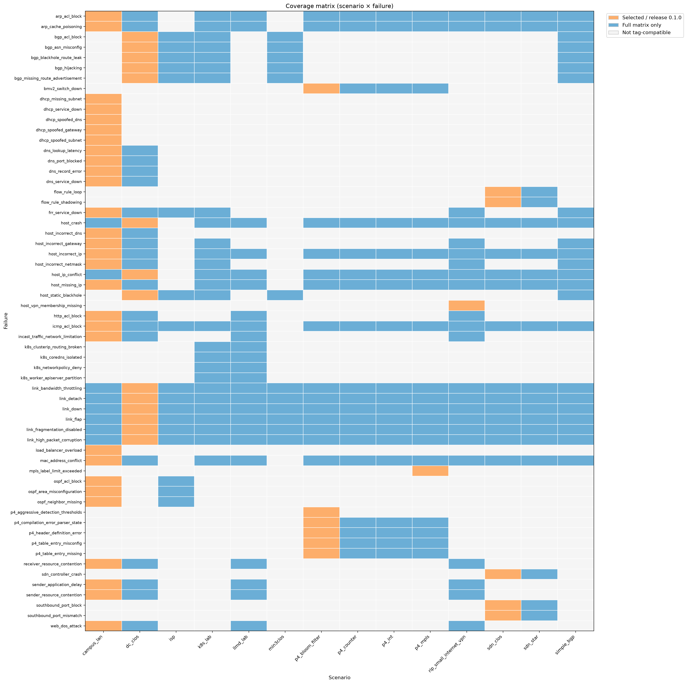

# Benchmark configuration reference

This reference is for maintainers and benchmark operators who need to choose a frozen release or a working YAML matrix and understand its artifact layout.

Implementation: [`benchmark/`](../benchmark/) stores matrices and releases; [`workflows/benchmark/`](../src/nika/workflows/benchmark/) loads and executes them.

## Frozen release (`nika-bench@0.1.0`)

Official reproducible suite with **Dev** and **Test** splits (both in-tree):

| Path | Role |
|------|------|
| [`benchmark/releases/0.1.0/`](../benchmark/releases/0.1.0/) | Frozen release: `RELEASE.yaml` + `dev.yaml` + `test.yaml` |
| Identity | `nika-bench@0.1.0` (aliases: `nika@0.1`, `nika@0.1.0`; also `@sha256:<digest>`) |
| Dev | **56** curated incidents, one per included release failure type, for development and debugging |
| Test | **56** held-out instances with the same failures and different scenarios or injection parameters |

```shell
nika benchmark run --release 0.1.0          # release run
nika benchmark run --release 0.1.0 --result_dir results/my-run
nika benchmark releases                     # list + preflight-verify each release
```

Dev/Test case files live under the release directory for maintainers; `--release` uses the suite’s `default_split_for_release` (Test for `0.1.0`) without exposing split knobs. There is no bare default: omit `--release` / `--config` and the CLI errors.

Each release run treats `--result_dir` as **one run** and writes:

| Path | Role |
|------|------|
| `run.json` (and legacy `benchmark_job.json`) | Durable run config: release identity/`benchmark_digest`, `split`, `cases_sha256`, agent/model/`n_trials`, timeout, `official`, stable `run_id` |
| `RELEASE.lock.json` | Slim identity lock |
| `trials/{case_key}__tNN/` | One counted trial (session artifacts) |

Active run progress is recorded under `runtime/benchmark_runs/{run_id}.json`.

After a finished release run, pack and validate a leaderboard submission. See the [leaderboard submission guide](leaderboard-submission.md).

```shell
nika leaderboard template -o results/my-run/submission
# edit metadata.yaml + README.md
nika leaderboard pack --result_dir results/my-run --submission results/my-run/submission
nika leaderboard validate results/my-run/YYYYMMDD_slug --source-result-dir results/my-run
```

`defaults.n_trials` in `RELEASE.yaml` (3 for `0.1.0`) expands the split to `case_count × n_trials` deterministic trials. Resume skips completed trials, including `outcome=agent_failed`. NIKA cleans and reruns incomplete trials in place, so retries stay within K. Different `--result_dir` values create isolated runs and do not skip each other's trials.

Per-trial `run.json` is stamped with the same release identity fields plus `trial_id` / `trial_index` / `outcome`.

## Working YAML matrices

| File | Count | Role |
|------|------:|------|
| `benchmark_selected.yaml` | **56** | Editable curated suite (source for freezing a release) |
| `benchmark_full.yaml` | **727** | Full scenario × failure × size matrix (60 represented problem IDs) |

Ad-hoc `--config` uses the **same** batch orchestrator and `trials/{case_key}__t01/` layout as release runs, with `n_trials=1` (no release `run.json` / `runtime/benchmark_runs` progress unless you go through `--release`).

Each case includes an `inject` map that NIKA passes to `nika failure inject` as `--set` flags. Device names must match the target scenario topology. Working matrices and frozen releases also carry materialized `root_causes`. NIKA derives these labels from the failure implementation and checks them again during injection. The `scenario`, `problem`, `topo_size`, and `inject` fields continue to define case identity. See [Root-cause ground truth and scoring](root-cause-evaluation.md).

```shell
nika benchmark run --config benchmark/benchmark_selected.yaml
nika benchmark run --config benchmark/benchmark_full.yaml
nika benchmark migrate --input path/to/legacy.yaml --output path/to/labeled.yaml --report path/to/report.yaml
```

The migration command accepts a case matrix with a top-level `cases` field, not a release `RELEASE.yaml` manifest. It writes unresolved rows and exits with status 1 unless you pass `--allow-unresolved`.

## Tags

Scenarios and failures declare capability `TAGS`. A failure may run on a scenario only when **every problem tag is present on the scenario** (`problem.TAGS ⊆ scenario.TAGS`). The full matrix is the Cartesian product of tag-compatible pairs (plus topo sizes where required). The selected/release suite picks one traditional Kathara scenario for each included failure; Kubernetes-only failures stay full-matrix-only.

### Tag meanings

| Tag | Meaning |
|-----|---------|
| `arp` | ARP / L2 neighbor resolution present |
| `bgp` | BGP routing (FRR or equivalent) |
| `bloom_filter` | P4 bloom-filter program |
| `coredns` | Kubernetes CoreDNS service |
| `clos` | Clos / leaf-spine style fabric |
| `containerlab` | Containerlab backend (not Kathara) |
| `dhcp` | DHCP server / clients in the lab |
| `dns` | DNS server / resolver path |
| `fabric` | Multi-switch fabric topology |
| `fat-tree` | Fat-tree underlay (k8s lab) |
| `frr` | FRRouting daemons on routers |
| `http` | HTTP / web service endpoints |
| `icmp` | ICMP reachability usable for diagnosis |
| `ingress` | Kubernetes ingress path |
| `inference` | LLM inference workload (llmd) |
| `int` | P4 In-band Network Telemetry |
| `k3s` | Lightweight Kubernetes (k3s) |
| `k8s_control_plane` | Kubernetes control-plane access |
| `k8s_storage` | Kubernetes storage workloads |
| `k8s_workload` | Kubernetes application workloads |
| `kube_proxy` | Kubernetes Service routing via kube-proxy |
| `kubernetes` | Kubernetes control/data plane |
| `link` | Controllable L2/L3 links (down, flap, QoS, …) |
| `llm` | LLM-serving scenario features |
| `load_balancer` | Load-balancer node/service |
| `mac` | MAC addressing / L2 identity |
| `metallb` | MetalLB service advertisement |
| `mpls` | P4 MPLS label stack |
| `network_policy` | Kubernetes NetworkPolicy enforcement |
| `ospf` | OSPF intradomain routing |
| `p4` | BMv2 / P4 switches |
| `pc` | End hosts (PCs) that can be misconfigured |
| `sdn` | SDN controller + OpenFlow switches |
| `srl` | Nokia SR Linux NOS (Containerlab) |
| `vpn` | VPN membership / tunnels |
| `web` | Web-tier services (alias capability for HTTP labs) |

### Scenario tags

| Scenario | Tags |
|----------|------|
| `dc_clos` | `arp`, `bgp`, `dns`, `frr`, `http`, `icmp`, `link`, `mac`, `pc` |
| `isp` | `bgp`, `containerlab`, `frr`, `icmp`, `igp`, `isis`, `isp`, `link`, `ospf`, `sndlib`, `srl` |
| `k8s_lab` | `arp`, `bgp`, `coredns`, `fat-tree`, `frr`, `icmp`, `ingress`, `k3s`, `k8s_control_plane`, `k8s_storage`, `k8s_workload`, `kube_proxy`, `kubernetes`, `link`, `mac`, `metallb`, `network_policy`, `pc` |
| `llmd_lab` | `arp`, `coredns`, `http`, `icmp`, `inference`, `k3s`, `k8s_control_plane`, `kube_proxy`, `kubernetes`, `link`, `llm`, `mac`, `metallb`, `network_policy`, `pc` |
| `min3clos` | `bgp`, `clos`, `containerlab`, `fabric`, `link`, `srl` |
| `campus_lan` | `arp`, `dhcp`, `dns`, `frr`, `http`, `icmp`, `link`, `load_balancer`, `mac`, `ospf`, `pc`, `web` |
| `p4_bloom_filter` | `arp`, `bloom_filter`, `icmp`, `link`, `mac`, `p4`, `pc` |
| `p4_counter` | `arp`, `icmp`, `link`, `mac`, `p4`, `pc` |
| `p4_int` | `arp`, `icmp`, `int`, `link`, `mac`, `p4`, `pc` |
| `p4_mpls` | `arp`, `icmp`, `link`, `mac`, `mpls`, `p4`, `pc` |
| `rip_small_internet_vpn` | `arp`, `frr`, `http`, `icmp`, `link`, `mac`, `pc`, `vpn` |
| `sdn_clos` | `arp`, `icmp`, `link`, `mac`, `pc`, `sdn` |
| `sdn_star` | `arp`, `icmp`, `link`, `mac`, `pc`, `sdn` |
| `simple_bgp` | `arp`, `bgp`, `frr`, `icmp`, `link`, `mac`, `pc` |

## Statistics

| Metric | Count |
|--------|------:|
| Registered failure types | 60 |
| Failure types represented in `benchmark_full.yaml` | 60 |
| Full benchmark cases | 580 |
| Selected / release 0.1.0 cases | 56 |
| Scenarios in full matrix | 14 |

### Full matrix by scenario

| Scenario | Cases |
|----------|------:|
| `campus_lan` | 111 |
| `dc_clos` | 102 |
| `rip_small_internet_vpn` | 72 |
| `sdn_clos` | 57 |
| `sdn_star` | 57 |
| `k8s_lab` | 27 |
| `llmd_lab` | 24 |
| `simple_bgp` | 23 |
| `p4_bloom_filter` | 20 |
| `p4_mpls` | 20 |
| `p4_counter` | 19 |
| `p4_int` | 19 |
| `isp` | 17 |
| `min3clos` | 12 |

### Selected / release matrix by scenario

| Scenario | Cases |
|----------|------:|
| `campus_lan` | 29 |
| `dc_clos` | 14 |
| `p4_bloom_filter` | 6 |
| `sdn_clos` | 5 |
| `p4_mpls` | 1 |
| `rip_small_internet_vpn` | 1 |

Kubernetes scenarios (`k8s_lab`, `llmd_lab`) and Containerlab `min3clos` appear in the full matrix only; selected/release cases use traditional Kathara labs as the best-matching scenario per failure.

## Coverage matrix (scenario × failure)

Compatibility from `benchmark_full.yaml` (tag match). Cells ignore topo size: a colored cell means the pair appears at least once in the full matrix. For `dc_clos` and `campus_lan`, the matrix marks compatibility when the failure appears with the chosen workload (generation does not expand size × workload × failure). Legacy YAML may still say `dc_clos_bgp` / `dc_clos_service` or `ospf_enterprise_static` / `ospf_enterprise_dhcp`; loaders rewrite those to the canonical ids.

| Symbol | Meaning |
|--------|---------|
| Orange | Included in selected / release `0.1.0` |
| Blue | Present in full matrix only |
| Gray | Not tag-compatible |

Open the image and zoom to read full scenario and failure names.




## Regeneration

Regenerate working YAML files:

```shell
uv run python benchmark/generate_benchmark.py
```

Refresh the coverage matrix image after the working YAML changes:

```shell
uv run --group dev python scripts/plot_coverage_matrix.py
```

Freeze a new Dev+Test release from the current working YAML (re-selects Test instances from `benchmark_full.yaml`):

```shell
uv run python benchmark/generate_benchmark.py --release 0.2.0
```

Do not pass `--release 0.1.0`. That overwrites the published suite with a newly selected Test split. Bump the version directory for a new official suite.
